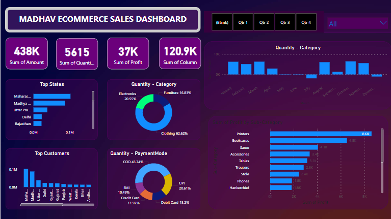
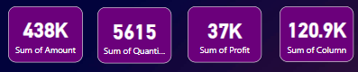
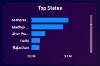
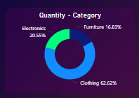
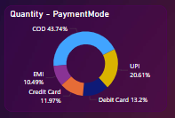
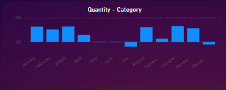
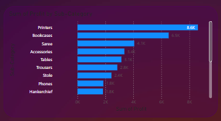

# Madhav Sales Report Data Visualization




## Order Data Overview

This document provides an overview of the order data, including details such as Order ID, Order Date, Customer Name, State, and City.

## Orders Table

### table-1
```
| Order ID | Order Date  | Customer Name  | State             | City       |
|----------|-------------|----------------|-------------------|------------|
| B-26055  | 10-03-2018  | Harivansh      | Uttar Pradesh     | Mathura    |
| B-25993  | 03-02-2018  | Madhav         | Delhi             | Delhi      |
| B-25973  | 24-01-2018  | Madan Mohan    | Uttar Pradesh     | Mathura    |
| B-25923  | 27-12-2018  | Gopal          | Maharashtra       | Mumbai     |
| B-25757  | 21-08-2018  | Vishakha       | Madhya Pradesh    | Indore     |
| B-25967  | 21-01-2018  | Sudevi         | Uttar Pradesh     | Prayagraj  |
| B-25955  | 16-01-2018  | Shiva          | Maharashtra       | Pune       |
| B-26093  | 27-03-2018  | Sarita         | Maharashtra       | Pune       |
| B-25798  | 01-10-2018  | Shishu         | Andhra Pradesh    | Hyderabad  |
```

### table-2
```
| Order ID | Amount | Profit | Quantity | Category    | Sub-Category        | Payment Mode  |
|----------|--------|--------|----------|-------------|---------------------|---------------|
| B-25681  | 1096   | 658    | 7        | Electronics | Electronic Games    | COD           |
| B-26055  | 5729   | 64     | 14       | Furniture   | Chairs              | EMI           |
| B-25955  | 2927   | 146    | 8        | Furniture   | Bookcases           | EMI           |
| B-26093  | 2847   | 712    | 8        | Electronics | Printers            | Credit Card   |
| B-25602  | 2617   | 1151   | 4        | Electronics | Phones              | Credit Card   |
| B-25881  | 2244   | 247    | 4        | Clothing    | Trousers            | Credit Card   |
| B-25696  | 275    | -275   | 4        | Clothing    | Saree               | COD           |
| B-25687  | 387    | -213   | 5        | Clothing    | Saree               | UPI           |
| B-25643  | 50     | -44    | 2        | Clothing    | Hankerchief         | UPI           |
```

## Data Summary

### Dashboard title


### Dashboard digital data 
### like
- total Revenue ,
- total Quantity ,
- total Profit ,
- total colurm ,



```
# Data Summary

| Value   | Description         |
|---------|---------------------|
| 438K    | Sum of Amount       |
| 5615    | Sum of Quantity     |
| 37K     | Sum of Profit       |
| 120.9K  | Sum of Column       |
```

### Top state wise Revenue 



```
# Data summary top five state
# like ,
- Maharastra
- Madhya Pradesh
- Uttar Pradesh
- Delhi
- Rajasthan

```
### Categorize wise Quanitity 



```
# Data Summary

|   Categorys   |  Value [ % ]  |
|---------------|---------------|
| Electronics   |   20.55 %     |
| Furniture     |   16.83 %     |
| Clothing      |   62.62 %     |

```

### Quanitity Salse wise payment method use



```
# Data Summary

|  payment method  |  Value [ % ]  |
|------------------|---------------|
| COD              |   43.74 %     |
| EMI              |   10.49 %     |
| UPI              |   20.61 %     |
| Debit Card       |   13.02 %     |
| Credit Card      |   11.97 %     |

```

### Mounth wise profit and loss 



```
# Data Summary

|   mounth   |  Value [profit/loss] |
|------------|----------------------|
| January    |       profit         |
| February   |       profit         |
| March      |       profit         |
| April      |       profit         |
| May        |       profit         |
| June       |       profit         |
| July       | <span style="color:red">loss</span> |
| August     |       profit         |
| September  |       profit         |
| October    |       profit         |
| November   |       profit         |
| December   |       loss           |  

```
### sub categorize wise profit 



```
# Data Summary

|  Sub category  |  Value [ k ]  |
|----------------|---------------|
| printer        |     8.6 k     |
| bookcase       |     6.5 k     |
| saree          |     4.1 k     |
| accessorise    |     3.4 k     |
| table          |     3.1 k     |
| trousers       |     2.8 k     |
| stole          |     2.4 k     |
| phone          |     1.8 k     |
| hankerchief    |     1.8 k     |

```

### Quter wise data divided


# total data summary

The Madhav Sales Report provides valuable insights into sales performance, highlighting areas of strength and opportunities for improvement. The data indicates a strong performance in clothing sales, with COD being the most popular payment method. Monitoring monthly profit and loss trends will be crucial for strategic planning and decision-making moving forward.


